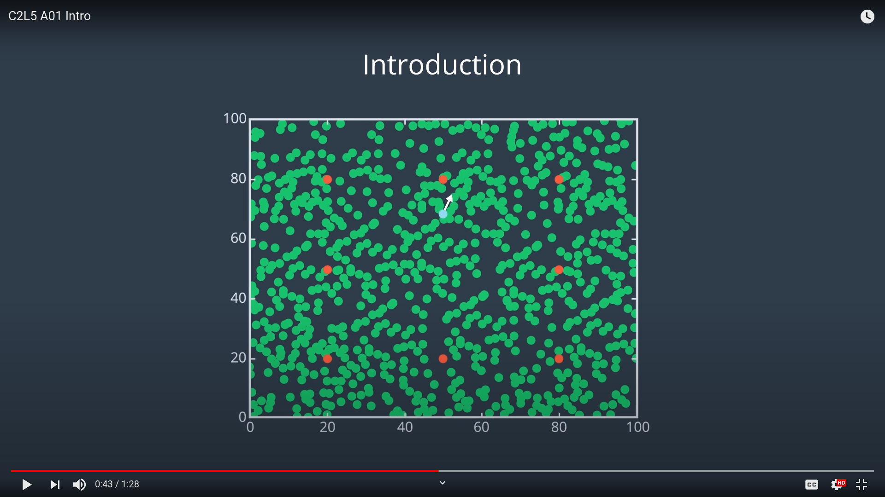
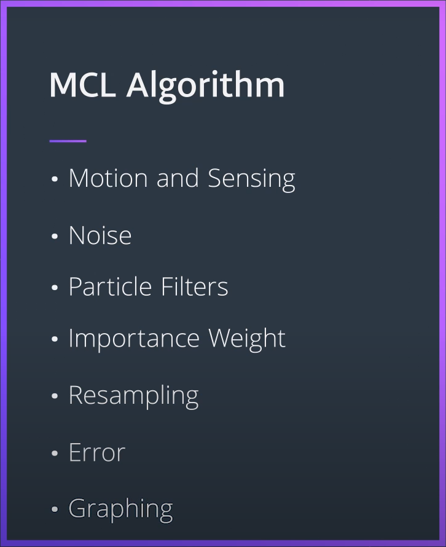

## MCL - Monte Carlo Localization

### Steps in MCL algorithm:

<!--  -->

<!-- [] (https://youtu.be/Z7tgQBESh7A  "MCL Steps") -->

<!--  -->

<!--  -->

 
<!--   -->

<!--  -->

<!-- - Motion and Sensing: move the robot and measure its distance from the landmarks
- Noise: simulate the noise and add to the measurements
- Particle Filters: randomly and uniformly spread particles throughout the map
- Importance Weight: evaluate the importance weight of each particle
- Resampling: resample the particles
- Error: generate an error value to check the overall quality of the solution. This will enable us to identify how close the particles are to the robot.
- Graphing: plot the position of the robot and the particles at each iteration of the MCL algorithm -->

 
 

| Steps | Description |
| --- | --- |
| Motion and Sensing | Move the robot and measure its distance from the landmarks |
| Noise | Simulate the noise and add to the measurements |
| Particle Filters | Randomly and uniformly spread particles throughout the map |
| Importance Weight | Evaluate the importance weight of each particle |
| Resampling | Resample the particles |
| Error | Generate an error value to check the overall quality of the solution. This will enable us to identify how close the particles are to the robot. |
| Graphing | Plot the position of the robot and the particles at each iteration of the MCL algorithm |

